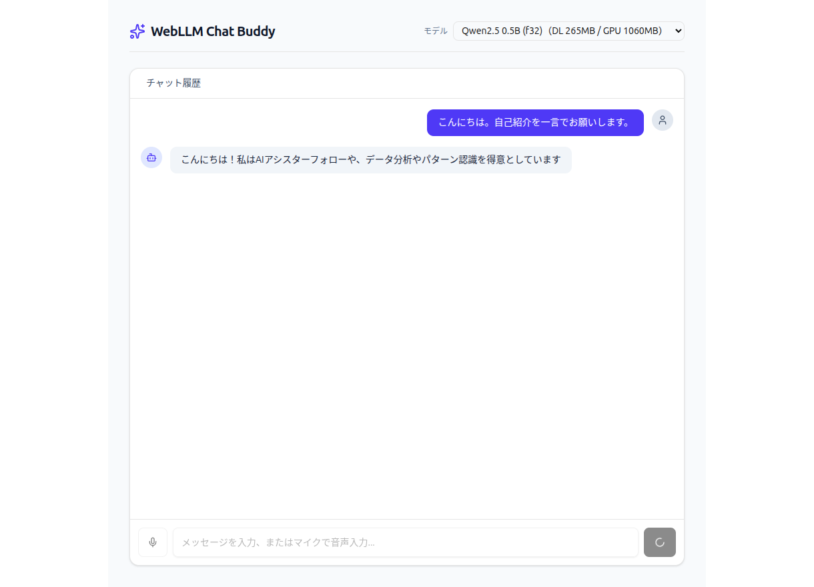
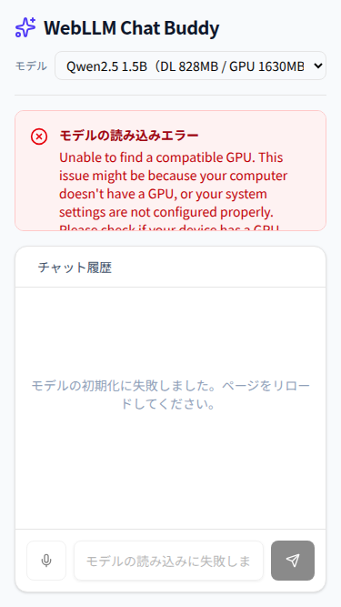

# webllm-chat-buddy

ブラウザだけで完結するローカルLLMチャットアプリ。サーバーもAPI課金も無し。[WebLLM](https://github.com/mlc-ai/web-llm)がWebGPU経由でユーザーのGPU上に小型LLM（4bit量子化、既定は `Qwen2.5-1.5B-Instruct`）を直接ロードして推論する。マイクからの音声入力([Web Speech API](https://developer.mozilla.org/docs/Web/API/Web_Speech_API))にも対応。

**ローカル実行のみを想定している**（公開ホスティングはしていない）。`make run` で起動してブラウザで開く。



上は実際に動作している画面。モデルをブラウザにダウンロードしたあと、GPU 上で推論して応答している（応答はローカルの小型モデルによるもので、品質はモデルサイズなりになる）。

## 特徴

- **サーバー不要**: LLMの推論はブラウザ内(WebGPU)で完結する。バックエンドは存在しない
- **音声入力**: マイクボタンで音声認識→テキスト入力欄に反映
- **モデル切替**: 用途・端末に応じて選択できる(下表)。選択はブラウザに保存される
- **ブラウザ内モデルキャッシュ**: 初回のみモデルをダウンロード、以降はブラウザキャッシュから読み込む

## プライバシーについて

- **チャットの推論**: WebLLMがブラウザ内(WebGPU)でモデルを実行するため、会話メッセージが外部サーバーへ送信されることはない
- **音声入力**: Web Speech APIを使用。ChromeなどのWeb Speech API実装は**サーバー側音声認識**のため、マイクで録音した音声データはブラウザベンダ(Google等)のサーバーへ送信され、テキストに変換されて返る。音声入力ボタンを使わない場合、この送信は発生しない

## 動作要件

- WebGPU対応ブラウザ(Chrome / Edge 推奨。`chrome://gpu` でWebGPUが有効か確認できる)
- マイク入力を使う場合はWeb Speech API対応ブラウザ(Chrome系)
- Android: Android 12 以降 + Chrome 121 以降(WebGPU対応の最小要件)
- 非対応ブラウザではその旨のメッセージが表示され、チャット機能は無効化される

スマートフォン幅にも対応している。



（上は WebGPU 非対応環境で開いたときの表示。エラー内容が読め、入力欄も画面内に収まる）

## セットアップ

```bash
make install
make run
```

`http://localhost:5173` を開く。初回アクセス時にモデルのダウンロードが始まる（進捗バーが出る）。

## モデルと初回ダウンロード量

画面上部のプルダウンで選択する。数値は実測値（重みファイルの合計サイズ／WebLLM が要求する GPU メモリ）。

| モデル | 初回ダウンロード | 要求GPUメモリ | `shader-f16` |
|---|---|---|---|
| Qwen2.5 0.5B | 約 265 MB | 945 MB | 必要 |
| Qwen2.5 0.5B (f32) | 約 265 MB | 1060 MB | **不要** |
| Gemma3 1B | 約 537 MB | 711 MB | 必要 |
| Llama 3.2 1B | 約 663 MB | 879 MB | 必要 |
| Qwen2.5 1.5B（既定） | 約 828 MB | 1630 MB | 必要 |

ダウンロード量と要求GPUメモリは比例しない（Gemma3 1B はダウンロードが Llama 3.2 1B より小さいが、要求GPUメモリはさらに小さい）。回線が細いときはダウンロード量、GPU が非力なときは要求GPUメモリを見て選ぶ。

モバイル環境（`navigator.userAgentData.mobile` または UA 文字列で判定）では既定が Qwen2.5 0.5B になる。

### `shader-f16` について

4bit 量子化には `q4f16` と `q4f32` の2種類があり、**`q4f16` は WebGPU の `shader-f16` 機能を必須とする**。この機能が使えない環境では、モデルのダウンロードが最後まで進んだあとにシェーダーのコンパイルで失敗する。

対応状況はブラウザとGPUドライバの構成で決まる。Linux では NVIDIA GPU を積んでいても、Vulkan の ICD（`/usr/share/vulkan/icd.d/nvidia_icd.json`）が入っていないと `shader-f16` が使えないことがある。

起動時に自動判定し、**使えない環境では `shader-f16` 不要のモデルだけを選択肢に出す**（保存済みの選択が f16 必須モデルだった場合も自動でフォールバックする）。判定中はモデル選択が一時的に操作不可になる。

### ダウンロードされる仕組み

「インストール」ではなく、ページを開いた JavaScript が実行時に取得してブラウザのキャッシュへ保存する。OS にもブラウザにも何も常駐しない。

1. wasm ランタイムを `raw.githubusercontent.com` から取得（推論エンジン本体）
2. モデルの重みを `huggingface.co` から取得（30 個前後のファイルに分割されている）
3. ブラウザのキャッシュ（Cache Storage の `webllm/model` / `webllm/wasm` / `webllm/config`）へ保存
4. GPU へアップロードして会話可能になる

2 回目以降はダウンロードが走らず、キャッシュから読み込む。消したい場合はブラウザの「サイトデータを削除」で消える。

## その他のコマンド

```bash
make help   # 利用可能なコマンド一覧
make ci     # lint / test / build をまとめて実行
```

## 技術構成

- Vite + React + TypeScript
- [`@mlc-ai/web-llm`](https://www.npmjs.com/package/@mlc-ai/web-llm): WebGPU上でのLLM推論エンジン
- Web Speech API: 音声認識(ブラウザ標準機能、追加ライブラリ無し)

CI workflow は `.github/workflows/ci.yml`。
